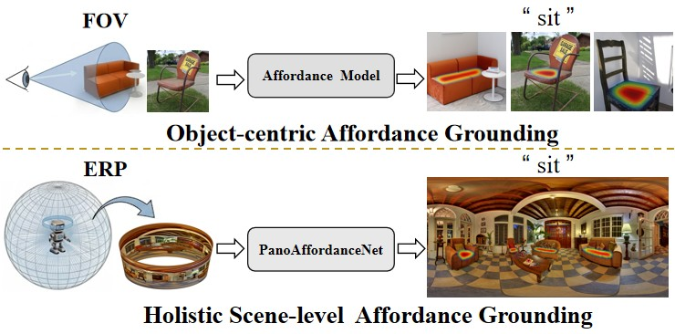

<!-- 

  <h1><strong>PanoAffordanceNet:<strong></h1>
  <h2><strong>Towards Holistic Affordance Grounding in 360° Indoor Environments<strong></h2>

 -->

# PanoAffordanceNet:
## Towards Holistic Affordance Grounding in 360° Indoor Environments

[**Guoliang Zhu**](https://github.com/GL-ZHU925)1, [**Wanjun Jia**](https://github.com/Dikay1)1, [**Caoyang Shao**](https://github.com/yAnaM1-AnNaa)1, [**Yuheng Zhang**](https://github.com/7uHeng)1, [**Zhiyong Li**](https://robotics.hnu.edu.cn/info/1176/2960.htm)1,2, [**Kailun Yang**](https://yangkailun.com/)1,2,†

1School of Artificial Intelligence and Robotics, Hunan University, China
2National Engineering Research Center of Robot Visual Perception and Control Technology, Hunan University, China
†Corresponding author: [kailun.yang@hnu.edu.cn](mailto:kailun.yang@hnu.edu.cn)

## 🖼️ Teaser

  

## 📖 Introduction

> **This work initiates the study of Holistic Affordance Grounding in 360° Indoor Environments.** Embodied agents require global awareness for their 360° action space, yet current affordance research remains limited to object-centric, perspective views. To bridge this gap, we introduce a new task of **holistic affordance grounding in 360° indoor environments**, shifting the paradigm from isolated object-level understanding toward holistic scene-level reasoning, and propose **PanoAffordanceNet** as a solid baseline for scene-level perception in embodied intelligence.

---

## 🚀 Coming Soon

- [ ] Release the **360-AGD** dataset.
- [ ] Release **PanoAffordanceNet** model architecture and training code.
---

## ✉️ Contact

For any inquiries or potential collaborations, please open an issue or contact:
`zhuzhuxia@hnu.edu.cn`
